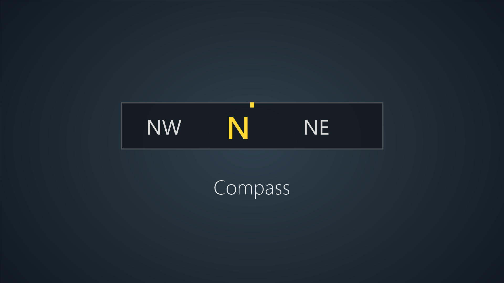

# Compass (Transport Fever 3 mod)

Shows which direction the camera is facing. "N" matches north on the minimap.

- **On screen:** a small strip compass (N, NE, E, …) that scrolls as you turn the camera, with the direction you face highlighted.
- **In the game bar:** the direction as text next to Earnings, e.g. "Northwest", "NW", "Northwest 315°" or "315°".
- Both can be shown at the same time, and the strip can show the heading in degrees too.
- When the camera follows a vehicle, the compass can show the vehicle's travel direction instead (with a lock as indicator).

Purely cosmetic: it doesn't change the savegame and achievements stay enabled.

## Settings

Configure the mod per savegame (Load Game → select save → Mods tab → gear icon on Compass):

| Setting | Options |
|---|---|
| Game bar | Off, Direction (default), Degrees, Direction and degrees |
| Game bar direction names | Full (Northwest, default), Compact (NW) |
| Screen compass | Off (default), Letters, Letters and degrees, Degrees |
| Screen compass position | Top left, Top center (default), Middle left, Bottom left, Bottom right |
| Screen compass size | Small, Medium (default), Large |
| North | Map (top of the minimap, default), Sun (rises in the east) |
| Show in free camera and follow view | Off (default), On |
| When following a vehicle, show | Camera direction (default), Vehicle travel direction |

There are no right-side positions: the game opens its vehicle, line, station and town windows along
the right edge.

Travel direction:
- **Pinned from the line or vehicle manager:** the game reports the vehicle
  (`api.gui.camera.getFollowEntity()`), and its exact direction is used.
- **Cockpit view:** started through the game's free camera tool with the vehicle as
  `cockpitCameraForEntity`; the mod wraps that tool's `push`/`pop`, so it knows the vehicle and uses its
  exact direction. The same wrapping tells it when free camera is active, where the camera direction is shown.
- **Follow view** (the engine's own follow mode): the game doesn't report the vehicle, so the direction is
  measured from how the camera moves: the vehicle moves the camera's eye and its look-at point the same
  way, while the player moving the camera moves only one of them.

"Sun (rises in the east)" turns the compass so the noon sun is in the north: the game's sun moves like in the
southern hemisphere (measured in game: noon sun at map heading ~100°, sunrise south of east in November).

## Installation

Copy this folder to `<Steam>/userdata/<your id>/3493540/local/mods/dk_compass`, then activate it for a savegame.

## How it works

- `content/gui/dk_compass/compass.script.tl` — the compass itself (Teal, compiled by the game at load).
- `content/gui/dk_compass/compass.res.lua` — wraps the HUD's full-screen celebrations overlay (normal view) and the callout overlay (free camera and follow view, where the game hides its normal HUD) so the compass can be placed anywhere on screen.
- `content/gui/dk_compass/compass_gamebar.res.lua` — adds the text version to the game bar's info row.
- `content/gui/dk_compass/compass.css.lua` — layout rules (React layouts shrink to their content unless told to fill).
